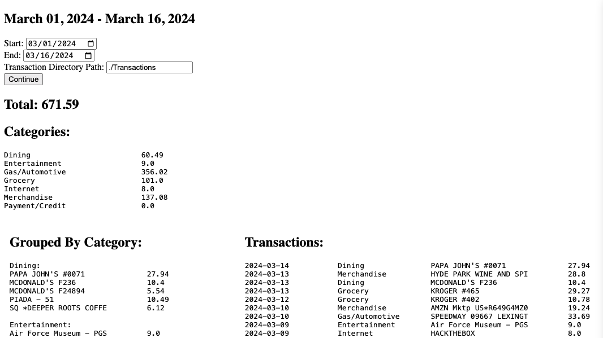

# Expenses

## Overview

Expenses is a Python tool designed to analyze credit card transactions from CSV files, categorize spending, and provide insights into the user's financial habits. The primary purpose is to help users track and manage their expenses, providing a breakdown of spending across various categories.



## Features

- **Graphical User Interface (GUI):** The `expenses.py` file contains a browser-based GUI allowing users to specify the location of their credit card CSV files and the dates to include in their analysis.

- **CSV File Operations:**
  - Combine transactions from multiple CSV files into a single CSV file.

- **Total Spending:**
  - Display the total amount spent in each category.
  - Display the overall amount spent during the given period.
  - Display all the transactions occurring in the specified time span.

## Installation

Open the Terminal application by entering Command + Space Bar and typing "Terminal"

Ensure dependencies are installed:
  - Python3 (the Run file will install Python3 if it is not already installed
  - Install git (takes about 8 minutes but includes a suite of tools commonly used):
```bash
xcode-select --install
```

Paste the following into the terminal:

   ```bash
   git clone https://github.com/loganflecke/Expenses.git
   cd Expenses
   ```

## Usage

1. Run the `Run` file:

   ```bash
   ./Run
   ```

2. Place your CSV file(s) in a directory called Transactions (or a name of your choice) within the Expenses directory that was just created.
3. Specify the Start and End dates

4. Use the webpage to specify the location of your credit card CSV files (ex: ./Transactions).

6. Click Continue.

## Future Enhancements

- **Budget Tracking:** Implement a budget tracking feature to compare actual spending against a predefined budget.

- **Visualizations:** Include graphical representations (charts, graphs) to enhance data visualization.
